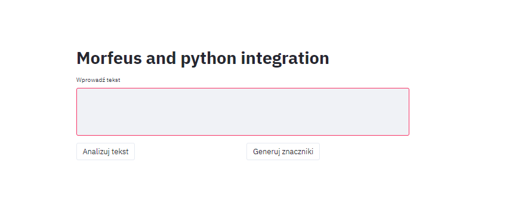
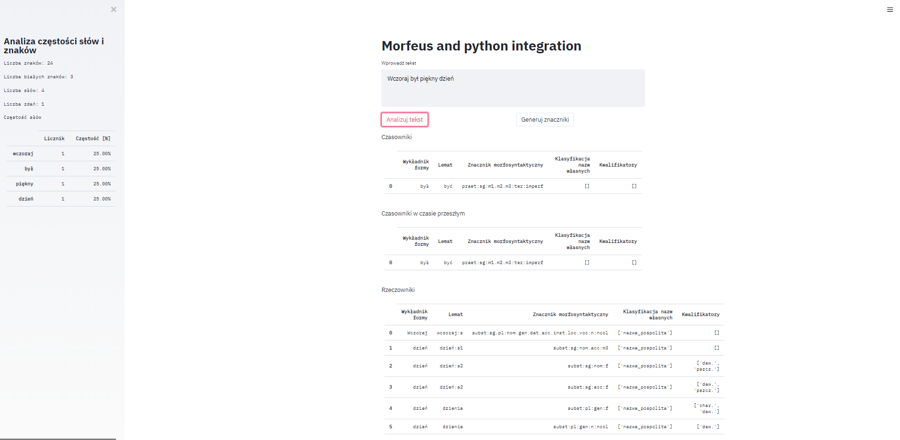

# Systemy_wyszukiwawcze
A simple app for analyse the words and text in Polish language.

Main packages
Streamlit and Morfeusz2

Write the sentences (click "Analizuj tekst") or word(click "generuj znaczniki" - it works only with one word) to analyse the given text.

At the start looks like this

After analyse the screen becomes as following. Then on the left we can see a simply statistics for given input

